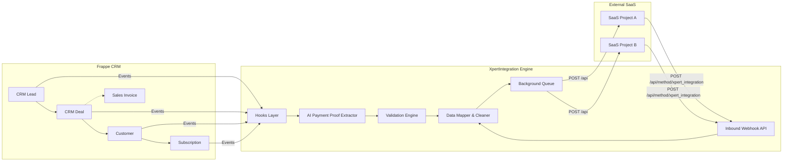

# XpertIntegration Technical Documentation

## Executive Overview
XpertIntegration is an all-in-one custom Frappe application functioning as an integration and middleware layer. Its core purpose is to synchronize data between a centralized Frappe-based CRM system and multiple external SaaS projects/systems (e.g., SaleDesk or Point-of-Sale endpoints). 

By centralizing and automating seamless data transfers, it ensures that when operations like Lead generation, Deal conversion, Payment verification, AI Payment extraction, or Customer/Subscription creations happen in the CRM, the external SaaS systems reflect the exact same state. Conversely, it provides an inbound webhook to receive data from external systems.

## XpertIntegration Purpose
The CRM acts as a unified portal for sales agents, accountants, and managers. When a deal reaches a specific stage (e.g., "In Trial") or a payment is verified, the relevant records (Customers, Subscriptions, Companies) must be provisioned in the specific external SaaS ("Project") the customer is buying. XpertIntegration:
1. Intercepts CRM events via Frappe hooks.
2. Validates mandatory fields, payment statuses, minimum cost thresholds, and specific business rules.
3. Analyzes payment proof image attachments using an integrated AI Vision model (Groq/Qwen) during document validation.
4. Resolves external connection settings based on the target "Project".
5. Transforms and cleans the Frappe documents into agnostic JSON payloads.
6. Pushes (broadcasts) the payload to the external SaaS using background queues.
7. Receives inbound webhooks from external SaaS to update Frappe records.

## Architecture



## Frappe App Structure
```text
apps/
└── xpertintegration/
    └── xpertintegration/
        ├── hooks.py           # Registers doc_events, override_whitelisted_methods
        ├── api/               # API Controllers (ai_analytics, integration, activities, session)
        │   ├── ai_analytics.py# AI Vision Payment Proof Extraction Engine (Groq / Qwen 2.7B)
        │   ├── activities.py  # Custom CRM Deal/Lead activity feed generator
        │   ├── integration.py # Core sync engine, validation rules, win conditions, broadcast
        │   └── session.py     # Session user, role fetching
        ├── page/              # Custom Pages & UI Modules
        │   ├── payment_verification/ # Modern Payment Verification Portal & Approval API
        │   └── saas_sales_dashboard/ # SaaS Sales KPI & Churn Analytics Dashboard
        ├── config/            # Desktop workspace configs
        ├── fixtures/          # Exported Custom Fields, Property Setters
        └── doctype/           # Custom DocTypes (e.g., Settings, Add-ons, Cities)
```

## DocTypes
| DocType | Module | Purpose |
| ------- | ------ | ------- |
| `XpertIntegration Setting Table` | XpertIntegration | Stores base URL, API route, Key, and Secret for external SaaS Projects. |
| `User Referral Code` | XpertIntegration | Maps referral codes to internal Users to assign ownership of incoming leads. |
| `CRM Call Log` | (Core CRM override) | Modified by hooks to update the `custom_last_call_log` summary on CRM Leads. |
| `Subscription Plan Add Ons` | XpertIntegration | Child table definitions used for mapping custom plan features. |

### Integration Configuration DocType
**DocType**: `XpertIntegration Setting Table`
- **Fields**: `project` (Link to Project), `base_url`, `api_url`, `api_key`, `api_secret`
- **Purpose**: Defines exactly where and how to connect to a SaaS tenant. The engine looks up the target URL based on the `custom_project` field on the originating CRM document.

## Hooks Analysis
`xpertintegration/hooks.py` defines critical intercepts (`doc_events`):

| DocType | Event | Triggered Function | Purpose |
| ------- | ----- | ------------------ | ------- |
| `Subscription Plan` | `on_update`, `on_trash` | `broadcast_subscription_plan`, `broadcast_delete_crm_document` | Syncs plan updates and deletions to external SaaS. |
| `CRM Lead` | `validate` | `validate_crm_fields` | Validates mobile numbers, checks for duplicates, resolves referral codes. |
| `CRM Lead` | `after_insert` | `after_crm_lead_insert` | Creates a follow-up Task for the assigned owner. Auto-converts to Deal if `custom_company_code` is present, injecting posting and due dates. |
| `CRM Deal` | `validate` | `validate_crm_deal` | Triggers AI payment proof extraction, enforces Payment Status = 'Paid' & Paid Amount > 0 before winning, checks minimum plan cost, locks 'Won' deals, verifies project settings exist before win/In Trial. |
| `CRM Deal` | `after_insert` | `after_crm_lead_insert` / `handle_deal_payment_task` | Creates a follow-up CRM Task or Accountant payment verification task. |
| `CRM Deal` | `on_update` | `broadcast_crm_deal`, `handle_deal_payment_task` | Triggers broadcast if Deal is "In Trial" or has a payment. Manages accountant task completion on status update. |
| `CRM Deal` | `on_trash`, `on_cancel` | `broadcast_delete_crm_document`, `broadcast_crm_document` | Syncs deletions via background queue and cancellations to SaaS. |
| `Customer` | `before_insert`, `on_update` | `before_customer_insert`, `broadcast_customer_company` | Syncs fields from Deal. Validates if the project allows company creation via remote API (`broadcast_customer_company`). |
| `Customer` | `after_insert` | `create_subscription` | Auto-creates a Subscription (maps `custom_project_subscription` from the Deal), attaches Sales Invoice, and builds Payment Entry automatically. |
| `Subscription` | `validate`, `on_update` | `validate_subscription`, `broadcast_subscription_wrapper` | Dynamically recalculates `custom_amount_paid` from plan rates and add-ons; syncs Subscription status to SaaS. |
| `Sales Invoice` | `after_insert/on_submit/on_update/on_change`| `broadcast_crm_document`, `update_deal_payment_status` | Broadcasts to SaaS on submit/change. Updates CRM Deal payment status continuously across states. |
| `Sales Invoice` | `on_cancel`, `on_trash`| `broadcast_crm_document`, `broadcast_delete_crm_document` | Syncs invoice cancellation and enqueues background deletion. |
| `Payment Entry` | `on_cancel`, `on_trash`| `broadcast_crm_document`, `broadcast_delete_crm_document` | Syncs payment cancellation and enqueues background deletion. |

---

## AI Payment Proof Extraction Engine

### Overview
Located in `xpertintegration/api/ai_analytics.py`, the `PaymentProofAnalyzer` automatically extracts payment details from attached payment proof images on CRM Deals during document validation.

### Workflow & Key Features
1. **Trigger Condition**:
   - Triggers synchronously inside `validate_crm_deal` when:
     - `custom_payment_proof` attachment is present.
     - `custom_paid_amount` is `0` or empty.
     - `custom_payment_date` and `custom_reference_number` are undefined.
2. **AI Vision Model**:
   - Utilizes **Groq Vision API** (`qwen/qwen3.6-27b` model).
   - Prompts the vision model for strict JSON output containing `paid_amount`, `payment_date` (`YYYY-MM-DD`), and `transaction_id`.
   - Incorporates negative prompt constraints to suppress internal `<think>` tags and conversational filler.
3. **Resilient JSON Parsing**:
   - Parses response with fallback regex to extract JSON blocks from mixed content.
4. **Automatic Compression & Hash Tracking**:
   - Compresses large image files before base64 encoding to optimize token usage.
   - Computes SHA256 file hashes (`custom_payment_ai_processed_hash`) to avoid redundant API calls on unchanged attachments.
5. **Robust Error Handling**:
   - Automatic HTTP fallback and retries on rate limits (`429`) and JSON validation errors (`400`).
   - Updates tracking fields on the CRM Deal:
     - `custom_payment_ai_status` ("Processing", "Completed", "Failed")
     - `custom_payment_ai_processed` ("1")
     - `custom_payment_ai_error` (Stores diagnostic error traces)

---

## CRM Deal Validation & Win Conditions

Before a CRM Deal can transition to the **"Won"** stage, `validate_crm_deal` enforces strict validation rules:

1. **Payment Status Requirement**:
   - `custom_payment_status` **must be `"Paid"`** before marking a deal as `"Won"`.
   - *Error*: `"Payment Status must be 'Paid' before marking the deal as Won."`
2. **Paid Amount Validation**:
   - When `custom_payment_status` is `"Paid"`, `custom_paid_amount` **must be greater than 0**.
   - *Error*: `"Paid Amount must be greater than 0 when Payment Status is set to Paid."`
3. **Minimum Sale Price Protection**:
   - Enforces `custom_sale_price >= custom_minimum_cost` defined on the linked `Subscription Plan`.
   - *Error*: `"Sale price cannot be less than {minimum_cost}"`
4. **Won Deal Immutability**:
   - Once marked `"Won"`, deals are locked against further modification (`old_status == "Won"`).
   - *Error*: `"This Deal has already been marked as 'Won' and cannot be edited."`
5. **Project Credentials & Mandatory Fields Verification**:
   - Verifies that `custom_project` is selected and that API credentials (`base_url`, `api_url`, `api_key`, `api_secret`) exist in `XpertIntegration Setting Table`.
   - Enforces 8 mandatory win fields: `first_name`, `email`, `mobile_no`, `territory`, `custom_sub_domain`, `custom_plan`, `custom_activation_start_date`, `custom_activation_end_date`.

---

## Document Timestamp & Concurrency Safeguards (`doc.reload()`)

To eliminate Frappe `TimestampMismatchError` (*"Document has been modified after you have opened it. Please refresh."*) during complex save/update cycles (e.g. payment verification approvals or automated subscriptions):
- `doc.reload()` is invoked prior to updating document attributes and immediately following `.save()` / `.insert()` operations.
- Applied across `integration.py` (`_safe_get_doc`, `process_incoming_integration_payload`), `ai_analytics.py` (`process_deal`), and `payment_verification.py` (`update_deal_status`).

---

## CRM → SaaS Flow (Outbound)

1. **Trigger**: A CRM user updates a CRM Deal to "In Trial" (or creates a Customer).
2. **Hook**: `doc_events` in `hooks.py` fires `xpertintegration.api.integration.broadcast_crm_deal`.
3. **Validation**: Checks `custom_project` existence. Ensures all mandatory SaaS fields (like `custom_sub_domain`, `custom_password`) are present.
4. **Data Prep**: `_build_broadcast_payload` converts the Frappe document to JSON, strips system fields (`creation`, `modified`, `__islocal`), normalizes child table metadata, and automatically serializes Python `date`/`datetime` objects into ISO 8601 strings.
5. **Enqueue**: Calls `frappe.enqueue("xpertintegration.api.integration._execute_broadcast", queue="long", ...)`.
6. **Execution (Background)**:
   - Uses `get_project_settings(project_id)` to retrieve API URL and Secret.
   - Converts Frappe file attachments to `base64` encoded strings.
   - Issues a `POST` request to the remote SaaS endpoint.

### Asynchronous Deletion & Cancellation Sync
When a CRM Deal, Sales Invoice, Payment Entry, or Subscription Plan is deleted (`on_trash`), the integration handles it seamlessly without blocking the Frappe UI:
- `broadcast_delete_crm_document` is invoked.
- It prepares a payload with `integration_action: delete` and offloads it to a background queue (`_execute_broadcast_delete`).
- Remote constraint errors (like `LinkExistsError` from a Point-of-Sale system) will not block local deletion but log errors to the Frappe `Error Log`.
- Cancellations (`on_cancel`) are synced via standard broadcasts, communicating a `docstatus: 2` to external systems.

---

## SaaS → CRM Flow (Inbound)

1. **Trigger**: External SaaS calls `POST /api/method/xpertintegration.api.integration.xpert_integration`.
2. **Endpoint Handler**: `xpert_integration(payload)` receives the JSON string.
3. **Parsing**: `process_incoming_integration_payload(payload)` reads the `doctype` key.
4. **Transform**:
   - Converts base64 file payloads into Frappe `File` DocTypes and links them.
   - Cleans child table internal IDs.
   - Resolves text names for `Project` and `Subscription Plan` links to local Frappe names.
   - For `Customer` incoming payloads, dynamically maps the `company` field based on `custom_project` mappings.
5. **Upsert**: Checks if the record exists via `name`. If it exists, calls `doc.reload()`, `doc.update()`, and `doc.save()`. Otherwise, `doc.insert()`. Sets `doc.flags.ignore_integration = True` to prevent infinite broadcast loops.

---

## API Architecture & Clients

### Outbound Client (`send_api_request`)
- **File**: `api/integration.py`
- **Method**: `POST`
- **Authentication**: `Authorization: token {api_key}:{api_secret}`
- **Payload Format**: `{"payload": { ...document data... }}`
- **Timeout**: 60 seconds
- **Callback Support**: If response JSON contains `{"message": {"callback_data": {...}}}`, local source document is updated with callback data.

### Inbound APIs (Exposed)
| Endpoint | Method | Purpose | Authentication |
| -------- | ------ | ------- | -------------- |
| `/api/method/xpertintegration.api.integration.xpert_integration` | POST | General inbound webhook for syncing data back to CRM. | standard Frappe API auth |
| `/api/method/xpertintegration.api.session.get_users` | GET | Custom user directory fetch respecting CRM roles. | standard Frappe API auth |
| `/api/method/xpertintegration.api.activities.get_activities` | GET | Generates a unified activity feed for Leads and Deals. | standard Frappe API auth |
| `/api/method/xpertintegration.xpertintegration.page.payment_verification.payment_verification.get_pending_deals` | GET | Fetches pending payment verification deals. | standard Frappe API auth |
| `/api/method/xpertintegration.xpertintegration.page.payment_verification.payment_verification.update_deal_status` | POST | Approves/rejects deal payments with editable verification attributes. | standard Frappe API auth |

---

## Advanced Capabilities & UI Enhancements

- **AI-Powered Payment Proof Analytics**: Integrated vision model for automated date, amount, and reference extraction directly from image attachments during deal save.
- **Payment Verification Portal**: Modern, card-based web interface (`/app/payment-verification`) with client-side pagination. Allows users to edit "Amount Received", "Mode of Payment", and "Account Paid To", advancing deal status to "Won" upon payment approval.
- **SaaS KPI & Churn Analytics Dashboard**: Real-time business dashboard (`/app/saas-sales-dashboard`) rendering daily/weekly/monthly lead, deal, and customer acquisition metrics alongside recent churn breakdown (<3 days, <7 days expiration intervals) with interactive card navigation.
- **Automated Subscription & Payment Entry Creation**: Upon deal completion, automatically generates linked Subscription records, attaches Sales Invoices, and builds corresponding Payment Entries based on CRM Deal details.
- **Dynamic Add-on Pricing**: Enables editable pricing for Subscription Add-ons, correctly propagating discounted sale prices through CRM Deals to Subscription Plan rates and automating total deal amounts.
- **Strict Customer-Company Validation**: Validates `Customer-Company` doctypes upon Deal transition to "In Trial", enforcing strict verification against linked projects and ensuring external companies are matched before proceeding.
- **Automated Lead to Deal Post-Setup**: When leads are generated via POS/SaaS signup, they are automatically converted to Deals, with default `custom_posting_date` (today) and `custom_due_date` (today + 5 days) injected.
