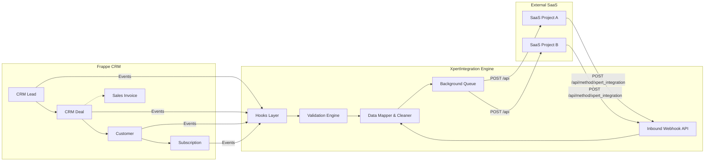

# XpertIntegration Technical Documentation

## Executive Overview
XpertIntegration is an all-in-one custom Frappe application functioning as an integration and middleware layer. Its core purpose is to synchronize data between a centralized Frappe-based CRM system and multiple external SaaS projects/systems (e.g., SaleDesk or Point-of-Sale endpoints). 

By centralizing and automating seamless data transfers, it ensures that when operations like Lead generation, Deal conversion, Payment verification, or Customer/Subscription creations happen in the CRM, the external SaaS systems reflect the exact same state. Conversely, it provides an inbound webhook to receive data from external systems.

## XpertIntegration Purpose
The CRM acts as a unified portal for sales agents, accountants, and managers. When a deal reaches a specific stage (e.g., "In Trial") or a payment is verified, the relevant records (Customers, Subscriptions, Companies) must be provisioned in the specific external SaaS ("Project") the customer is buying. XpertIntegration:
1. Intercepts CRM events via Frappe hooks.
2. Validates mandatory fields and specific business rules.
3. Resolves external connection settings based on the target "Project".
4. Transforms and cleans the Frappe documents into agnostic JSON payloads.
5. Pushes (broadcasts) the payload to the external SaaS using background queues.
6. Receives inbound webhooks from external SaaS to update Frappe records.

## Architecture



## Frappe App Structure
```text
apps/
└── xpertintegration/
    └── xpertintegration/
        ├── hooks.py           # Registers doc_events, override_whitelisted_methods
        ├── api/               # API Controllers (activities, integration, session)
        │   ├── activities.py  # Custom CRM Deal/Lead activity feed generator
        │   ├── integration.py # Core sync engine, validation, broadcast, incoming API
        │   └── session.py     # Session user, role fetching
        ├── config/            # Desktop workspace configs
        ├── fixtures/          # Exported Custom Fields, Property Setters
        └── doctype/           # Custom DocTypes (e.g., Settings, Add-ons, Cities)
```

## DocTypes
| DocType | Module | Purpose |
| ------- | ------ | ------- |
| `XpertIntegration Setting Table` | XpertIntegration | Stores base URL, API route, Key, and Secret for external SaaS Projects. |
| `User Referral Code` | XpertIntegration | Maps referral codes to internal Users to assign ownership of incoming leads. |
| `CRM Call Log` | (Core CRM override) | Modified by hooks to update the `custom_last_call_log` summary on CRM Leads. |
| `Subscription Plan Add Ons` | XpertIntegration | Child table definitions used for mapping custom plan features. |

### Integration Configuration DocType
**DocType**: `XpertIntegration Setting Table`
- **Fields**: `project` (Link to Project), `base_url`, `api_url`, `api_key`, `api_secret`
- **Purpose**: Defines exactly where and how to connect to a SaaS tenant. The engine looks up the target URL based on the `custom_project` field on the originating CRM document.

## Hooks Analysis
`xpertintegration/hooks.py` defines critical intercepts (`doc_events`):

| DocType | Event | Triggered Function | Purpose |
| ------- | ----- | ------------------ | ------- |
| `CRM Lead` | `validate` | `validate_crm_fields` | Validates mobile numbers, checks for duplicates, resolves referral codes. |
| `CRM Lead` | `after_insert` | `after_crm_lead_insert` | Creates a follow-up Task for the assigned owner. Auto-converts to Deal if `custom_company_code` is present. |
| `CRM Deal` | `validate` | `validate_crm_deal` | Locks 'Won' deals, enforces mandatory payment fields, verifies project settings exist before win. |
| `CRM Deal` | `after_insert` | `after_crm_deal_insert` | Creates a follow-up CRM Task. |
| `CRM Deal` | `on_update` | `broadcast_crm_deal` | Triggers broadcast if Deal is "In Trial" or has a payment. |
| `Customer` | `before_insert` | `before_customer_insert`, `broadcast_customer_company` | Syncs fields from Deal. Validates if the project allows company creation via remote API (`broadcast_customer_company`). |
| `Customer` | `after_insert` | `create_subscription` | Auto-creates a Subscription (maps `custom_project_subscription` from the Deal) and Sales Invoice based on CRM Deal parameters. |
| `Subscription` | `on_update` | `broadcast_subscription_wrapper` | Syncs Subscription status to SaaS, deriving company from mapped Project settings. |
| `Sales Invoice` | `after_insert/on_submit/on_update/on_change`| `broadcast_crm_document`, `update_deal_payment_status` | Broadcasts to SaaS on submit/change. Updates CRM Deal payment status continuously across states. |

## CRM → SaaS Flow (Outbound)

1. **Trigger**: A CRM user updates a CRM Deal to "In Trial" (or creates a Customer).
2. **Hook**: `doc_events` in `hooks.py` fires `xpertintegration.api.integration.broadcast_crm_deal`.
3. **Validation**: Checks `custom_project` existence. Ensures all mandatory SaaS fields (like `custom_sub_domain`, `custom_password`) are present.
4. **Data Prep**: `_build_broadcast_payload` converts the Frappe document to JSON, strips system fields (`creation`, `modified`, `__islocal`), and normalizes child table metadata.
5. **Enqueue**: Calls `frappe.enqueue("xpertintegration.api.integration._execute_broadcast", queue="long", ...)`.
6. **Execution (Background)**:
   - Uses `get_project_settings(project_id)` to retrieve API URL and Secret.
   - Converts Frappe file attachments to `base64` encoded strings.
   - Issues a `POST` request to the remote SaaS endpoint.

## SaaS → CRM Flow (Inbound)

1. **Trigger**: External SaaS calls `POST /api/method/xpertintegration.api.integration.xpert_integration`.
2. **Endpoint Handler**: `xpert_integration(payload)` receives the JSON string.
3. **Parsing**: `process_incoming_integration_payload(payload)` reads the `doctype` key.
4. **Transform**:
   - Converts base64 file payloads into Frappe `File` DocTypes and links them.
   - Cleans child table internal IDs.
   - Resolves text names for `Project` and `Subscription Plan` links to local Frappe names.
   - For `Customer` incoming payloads, dynamically maps the `company` field based on `custom_project` mappings.
5. **Upsert**: Checks if the record exists via `name`. If it exists, calls `doc.update()`. Otherwise, `doc.insert()`. Sets `doc.flags.ignore_integration = True` to prevent an infinite broadcast loop.

## API Architecture & Clients

### Outbound Client (`send_api_request`)
- **File**: `api/integration.py`
- **Method**: `POST`
- **Authentication**: `Authorization: token {api_key}:{api_secret}`
- **Payload Format**: `{"payload": { ...document data... }}`
- **Timeout**: 60 seconds
- **Callback Support**: If the response JSON contains `{"message": {"callback_data": {...}}}`, the local source document is updated with that data.

### Inbound APIs (Exposed)
| Endpoint | Method | Purpose | Authentication |
| -------- | ------ | ------- | -------------- |
| `/api/method/xpertintegration.api.integration.xpert_integration` | POST | General inbound webhook for syncing data back to CRM. | standard Frappe API auth |
| `/api/method/xpertintegration.api.session.get_users` | GET | Custom user directory fetch respecting CRM roles. | standard Frappe API auth |
| `/api/method/xpertintegration.api.activities.get_activities` | GET | Generates a unified activity feed for Leads and Deals. | standard Frappe API auth |

## Field & ID Mapping

Data is kept highly symmetrical. 
- XpertIntegration does **not** maintain a separate mapping table DocType. 
- It relies on identical field names (`custom_project`, `custom_plan`, `custom_sub_domain`, `custom_activation_start_date`).
- **Internal ID Mapping**: The SaaS application is expected to accept the CRM's `name` (primary key) and use it, or conversely, XpertIntegration's `broadcast_config` can strip the `name` field to force the remote system to generate its own ID (currently `strip_name_for_remote_create: False`).

## Error Handling & Retry Architecture
- **Inbound Errors**: If an inbound sync fails, `frappe.log_error()` writes a full traceback to the Error Log DocType. The API returns an HTTP 500.
- **Outbound Errors**: The `requests.exceptions.HTTPError` is caught in `send_api_request`. The raw response, status code, and target URL are logged via `frappe.logger("xpertintegration")` and `frappe.log_error`.
- **Retries**: There is **no automatic exponential backoff or retry queue** implemented. Failed requests must be triggered manually by saving the document again, or by inspecting the Frappe Error Logs and resolving the data validation error.

## Authentication
- **External SaaS Credentials** are stored in the database in the `XpertIntegration Setting Table`.
- When an outbound request is generated, `get_project_settings()` queries the database and caches the `(url, headers)` tuple using `frappe.cache()` for 300 seconds. 

## Background Jobs
- **Broadcast Execution**: `_execute_broadcast`
- **Queue**: `long` (managed by Frappe/Redis RQ)
- **Reason**: API calls over the internet can take seconds and attachments need base64 encoding. Processing this synchronously in the `on_update` hook would freeze the CRM UI.

## How to Add a New SaaS Integration
Because XpertIntegration acts as a generalized broadcasting engine rather than having hardcoded SaaS-specific logic, adding a new external SaaS system is purely data-driven:

1. **Create the Project**: Create a new standard Frappe `Project` record representing the SaaS tenant.
2. **Add Credentials**: Create an entry in `XpertIntegration Setting Table` linked to that Project, providing the target URL, API Key, and API Secret.
3. **Map Fields**: Ensure the external SaaS system has an endpoint that accepts the raw Frappe JSON schema (or uses a middleware that parses it).
4. **CRM Usage**: When a CRM Deal is created, select the new `Project` in the `custom_project` field. XpertIntegration will automatically route the payload to the new SaaS URL.

## How to Debug an Integration
1. **Trigger the Event**: Save the Deal/Customer in the CRM.
2. **Check Background Jobs**: Go to Frappe's `Background Jobs` list to see if the `_execute_broadcast` task failed or is queued.
3. **Check Error Logs**: Open `Error Log` in Frappe. Look for "Broadcast Execution Failed" or "HTTP Error X".
4. **Inspect Validation**: Check if the Deal has a `custom_project` assigned. Without it, the broadcast silently skips.
5. **Check Credentials**: Verify `XpertIntegration Setting Table` has the correct `api_url` without trailing slashes.

## Documentation Verification
- **Files analyzed**: `hooks.py`, `api/integration.py`, `api/session.py`, `api/activities.py`.
- **DocTypes identified**: `XpertIntegration Setting Table`, `Subscription Plan Add Ons`, `User Referral Code`.
- **Unknowns**: How external SaaS endpoints process the inbound JSON is unknown (assumed to be a mirrored Frappe instance or compatible middleware based on the schema). No explicit retry queues are defined natively within this app outside of standard Frappe background worker behavior.
